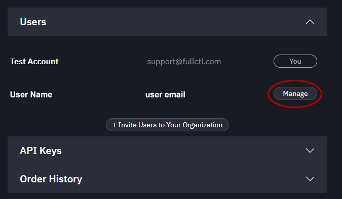
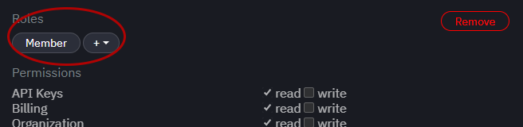
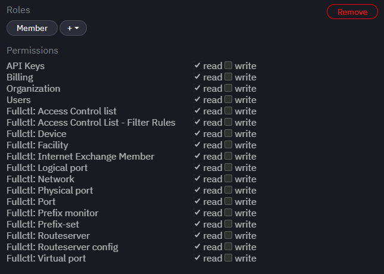

# User Privileges

To assign User privileges, click on the Manage button next to the User’s name. 
   
   
User roles (e.g., admin, member) can be chosen from the drop-down menu. A user can have more than one role. Each role has specific read/write privileges by default. 
   
   
The roles can be customized using the checkboxes. The Remove button provides the option of removing the User from the Organization. 
   
   
The following is a list of User privilege options: 

- API Keys = manage organization’s API keys (aaaCtl)
- Billing = manage organization's billing (aaaCtl)
- Organization = manage organization’s settings (aaaCtl)
- Users = manage organization’s users (aaaCtl)
- Fullctl: Access Control list = manage access control list (aclCtl)
- Fullctl: Access Control List - Filter Rules = manage filter rules (aclCtl)
- Fullctl: Device = manage devices (deviceCtl)
- Fullctl: Facility = manage facilities (deviceCtl)
- Fullctl: Internet Exchange Member = manage members (ixCtl)
- Fullctl: Logical port = manage logical ports (deviceCtl)
- Fullctl: Network = manage network ports (deviceCtl)
- Fullctl: Physical port = manage physical ports (deviceCtl)
- Fullctl: Port = used in deviceCtl (deviceCtl)
- Fullctl: Prefix location = view prefix location data (prefixCtl)
- Fullctl: Prefix monitor = add a prefix monitor (prefixCtl)
- Fullctl: Prefix reputation = generate or view reputation report (prefixCtl)
- Fullctl: Prefix-set = mange prefix set (prefixCtl)
- Fullctl: Routeserver = mange route servers (ixCtl)
- Fullctl: Routeserver config = mange route server configuration (ixCtl)
- Fullctl: Virtual port = used in deviceCtl (deviceCtl)
