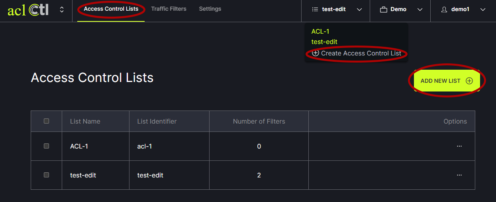
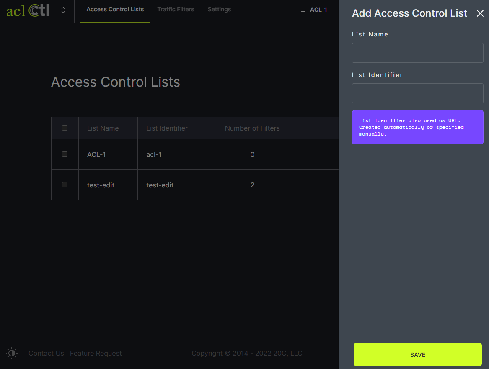
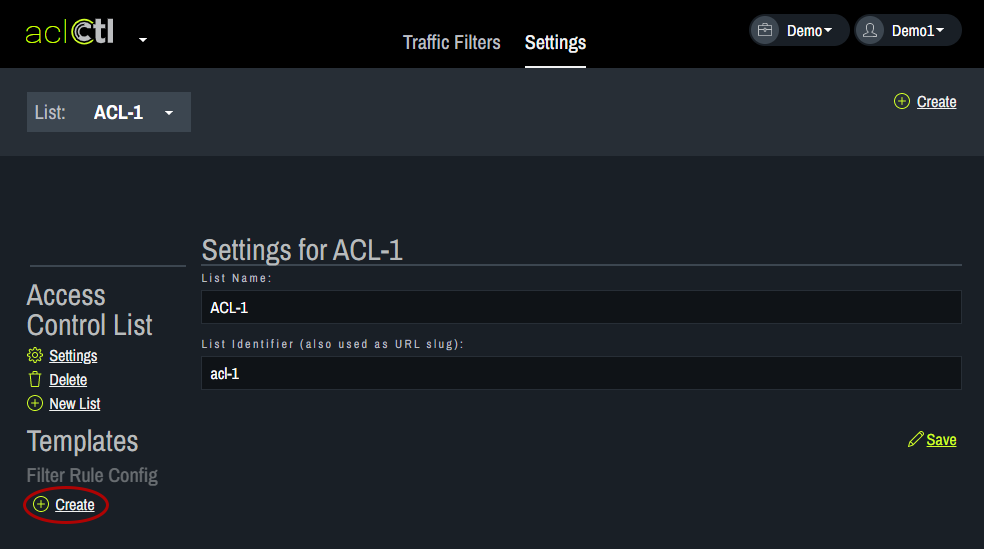
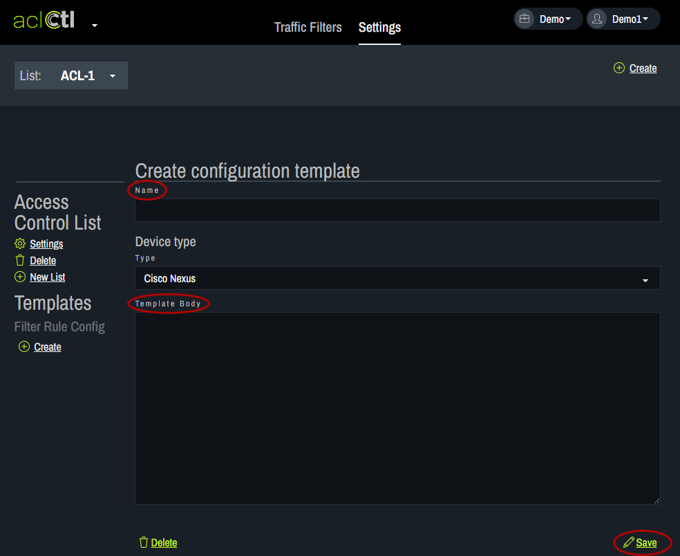

# Access Control List
aclCtl allows users to maintain a list of rules that regulate where traffic will/will not go. Filter rules can be added, edited and deleted. The rules can also be prioritized.

Access Control Lists are used to manage filter rules. The filter rules are contained within Access Control Lists. There can be multiple lists of rules. To add a new list, click on New List under Access Control List on the left. 
    
Enter the list name and list identifier. Click save. Create as many lists as desired.
   
A template is then used to generate an access control list configuration for your device. To add a template, choose the desired list from the drop down menu at the top.
   
Click on Create under Filter Rule Config.
   
Enter the list name and the text for the template body. Click save. 
   