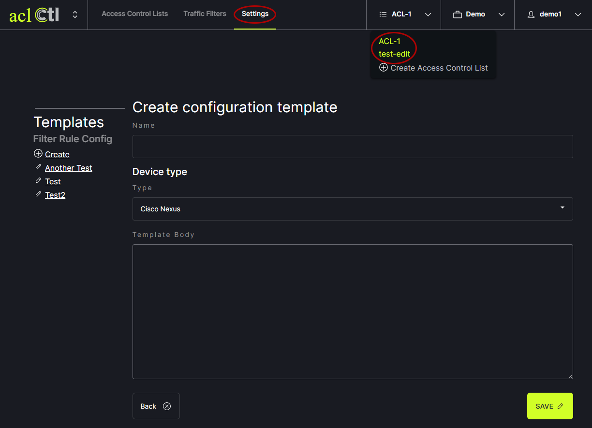
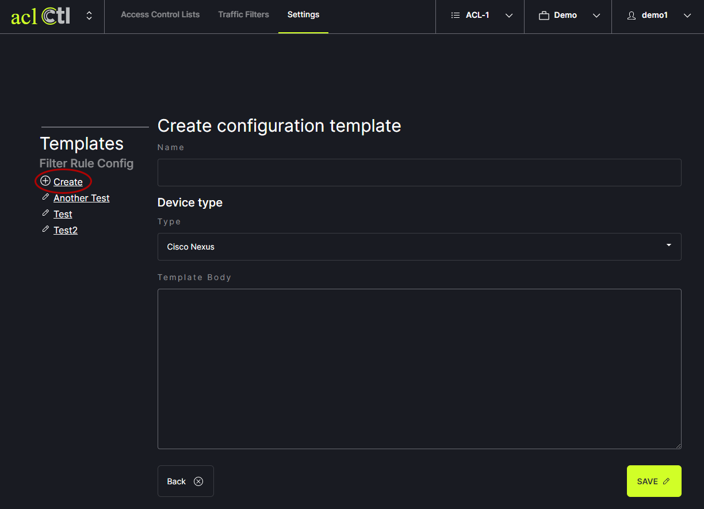
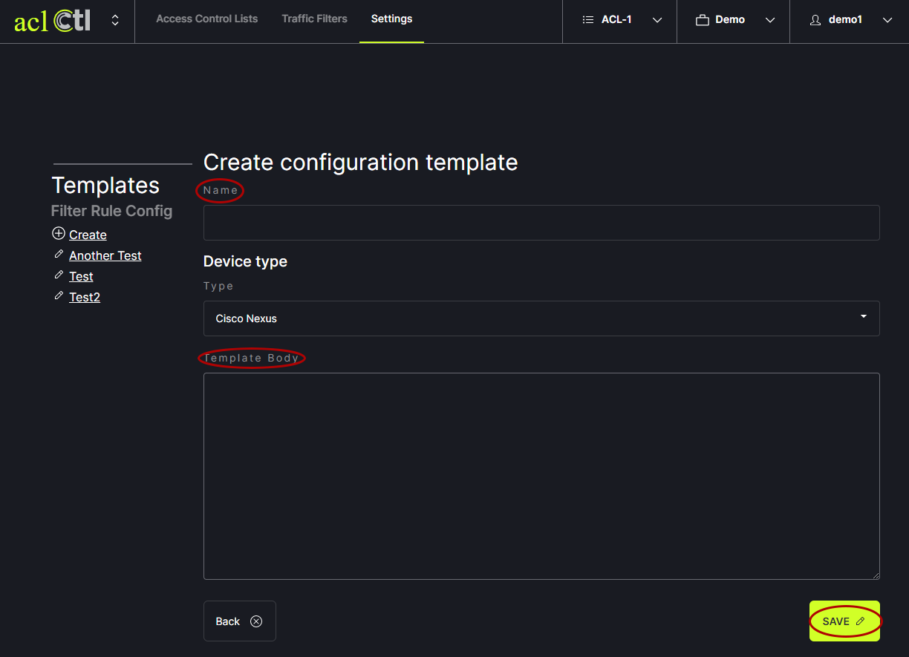

# Access Control List
aclCtl allows users to maintain a list of rules that regulate where traffic will/will not go. Filter rules can be added, edited and deleted. The rules can also be prioritized.

Access Control Lists are used to manage filter rules. The filter rules are contained within Access Control Lists. There can be multiple lists of rules. To add a new list, click on the Access Control Lists tab in the header menu. Then click the Add New List Button on the right side of the screen or the Create Access Control List option in the drop down in the header.
   

In the modal, enter the list name. The list identifier will be generated automatically. Click save. Create as many lists as desired.
   

A template is then used to generate an access control list configuration for your device. To add a template, click on the Settings tab in the header menu. Choose the list for which a template is desired from the drop down menu in the header.
   

Click on Create under Filter Rule Config.
   

Enter the list name and the text for the template body. Click save.
   
