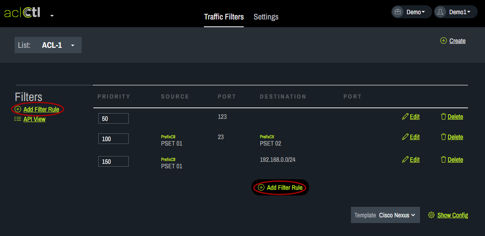
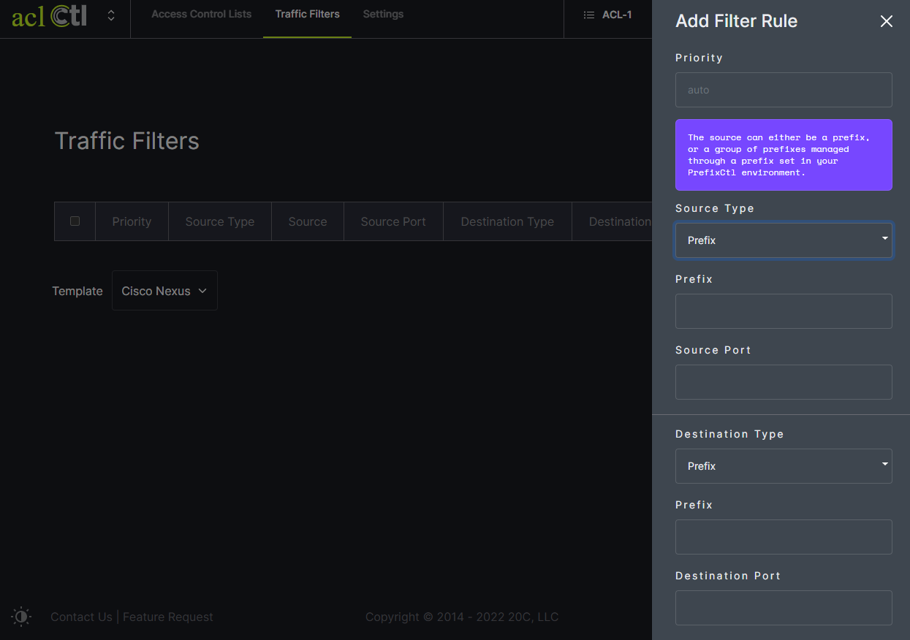

# Add a Rule
Filter rules can be added by clicking in one of two places - on the left under filters or at the bottom using the Add Filter Rule button.
    
In the popup box, first choose the source type. The prefix can be entered manually or pulled from PrefixCtl. Then, fill in the remaining fields and click save. 
   
A filter rule can be edited or deleted using the options to the right.
   
To review the generated filter rule configuration, click on Show Config and a popup box will appear.
   
   