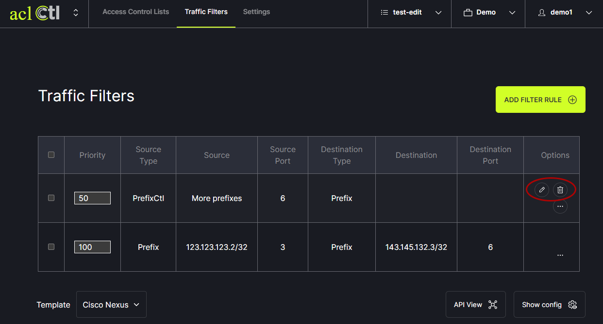
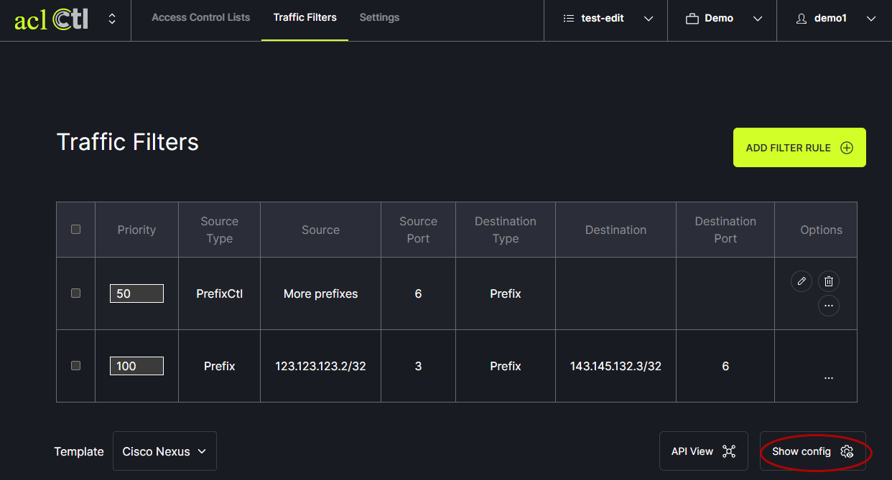
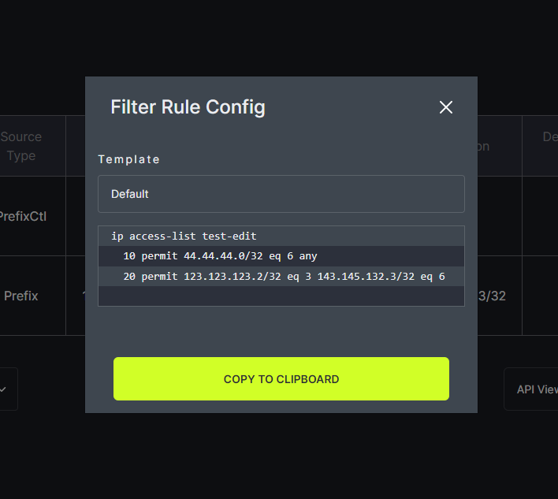

# Add a Rule

To add a filter rule, click on Traffic Filters in the header menu. Then click on the Add Filter Rule button. 
   

In the modal, first choose the source type. The prefix can be entered manually or pulled from PrefixCtl. Then, fill in the remaining fields and click save.
   

A filter rule can be edited or deleted using the options to the right.
   

To review the generated Access Control List filter rule configuration, click on Show Config and a popup box will appear.
   

The config can be copied from this box.
   
