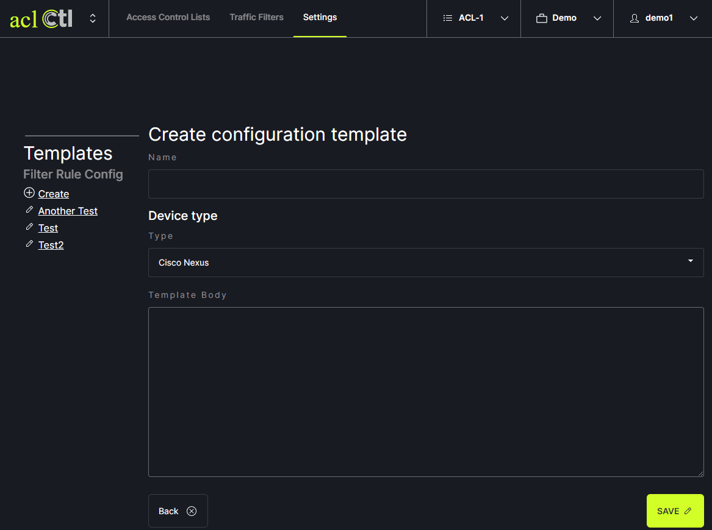

# Custom Templates

aclCtl supports the creation of custom configuration templates. To create a custom template, click on Settings in the header menu. 
   
Contact us for more information and proper syntax guidelines.
