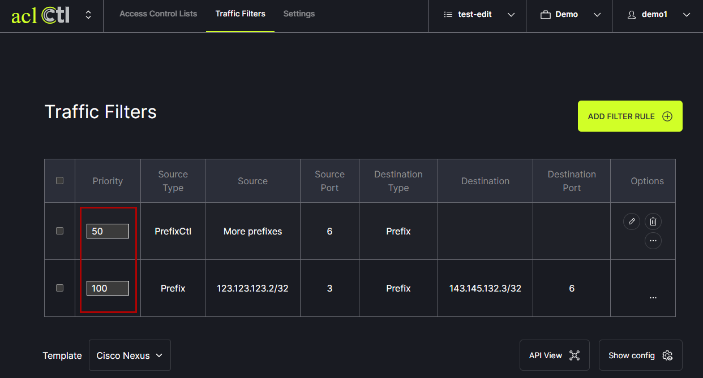

# Prioritize Rules
aclCtl progresses through the filter rules in the order they are listed. By default, filter rules are listed from lowest priority to highest priority. New filter rules are added to the bottom of the list. The priority can be set by changing the numbers in the Priority box. To change the priority of a filter rule, type a number into the box and hit enter. The list will automatically update to reflect the change in priority order.
    
