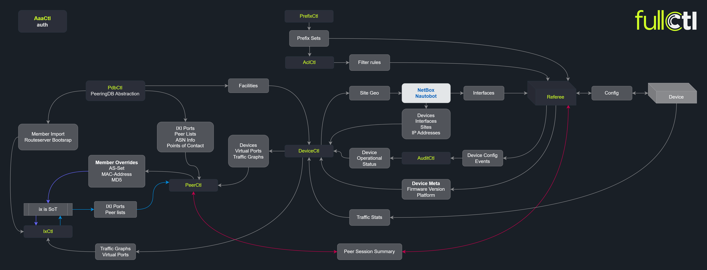

# Introduction to FullCtl

FullCtl is a network automation and orchestration software suite focused on providing a source of truth (SoT) for your network and provides a suite of tools to take actions and provide services based on that SoT.

In order to provide functionality for a variety of networks, FullCtl is made up of a number of modules. Some of these, like aclCtl, provide functionality to other modules, and some, like ixCtl provide interfaces and automation controllers directly. It should be noted that most modules do not act directly on your infrastructure, instead being communicated with by a variety of agents deployed in your infrastructure. These agents are typically containers providing services like route servers, but can also be proxy connections allowing your systems to securely communicate with FullCtl to obtain and act on information provided by the FullCtl SoT.

[FullCtl GitHub Repository](https://github.com/fullctl/fullctl)

# Why use FullCtl?

FullCtl can take the hassle and complexity out of managing a complex infrastructure. Using our modules to track SoT, implement best practices like RPKI and ROAs, and provide backups can give you a leg up on managing your infrastructure in a secure and up to date manner.

# FullCtl Components

- ixCtl is an automation platform and SoT built for internet exchange operators.
- PeerCtl is an automation platform, workflow manager, and SoT for interconnection and peering. It is used for managing all BGP sessions including peers and transit providers.
- PrefixCtl is the FullCtl SoT and monitor for prefix sets needed in BGP routing; used for managing IRR (Internet Routing Registry) and ROA (Route Origin Authorization) information. 
- DeviceCtl is the FullCtl SoT designed to manage devices and how they interconnect; can be used as a stand alone service, or as an abstraction layer and cache for tying into third party systems.
- AuditCtl manages incoming events and shows users what is happening at the orchestration level.
- pdbCtl is our abstraction layer for PeeringDB data, with support for bidirectional sync.
- aaaCtl is is our role based access control layer for Authentication, Authorization, and Accounting. It can operate as both a client and server for OAuth and Active Directory services.
- aclCtl is the FullCtl SoT for access control list (ACL) and network policy information. 
- custom Ctl - you can integrate FullCtl’s SoT with your existing workflow or custom code through our rich API, or 20c can create custom integrations for your specific needs.

# FullCtl Ecosystem

Contact us: <a href="mailto: hello@fullctl.com" target="_blank">hello@fullctl.com</a>

# FullCtl API Documentation
To access the API documentation for any of the FullCtl components, in the component's website click on the question mark icon in the lower right corner. In the popup, are links for Swagger and ReDoc.

