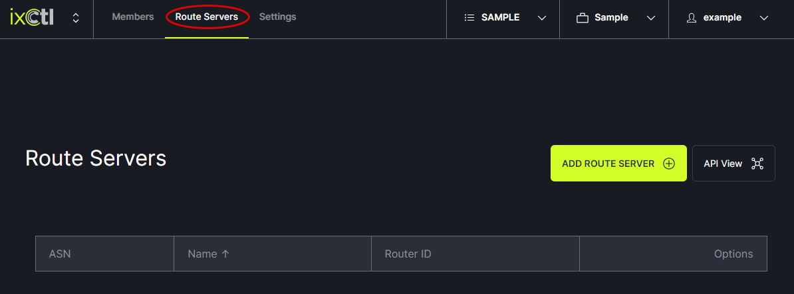
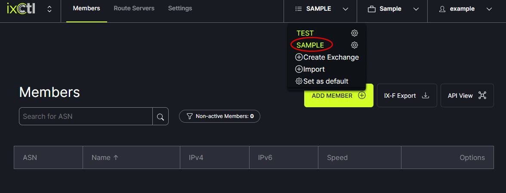
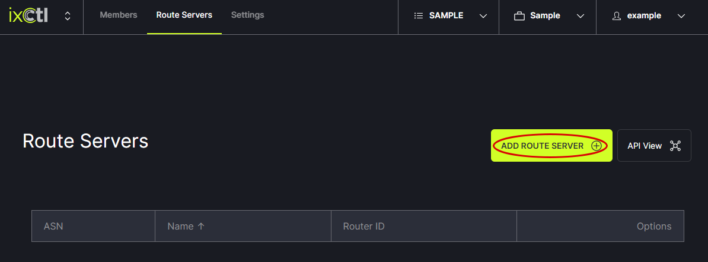
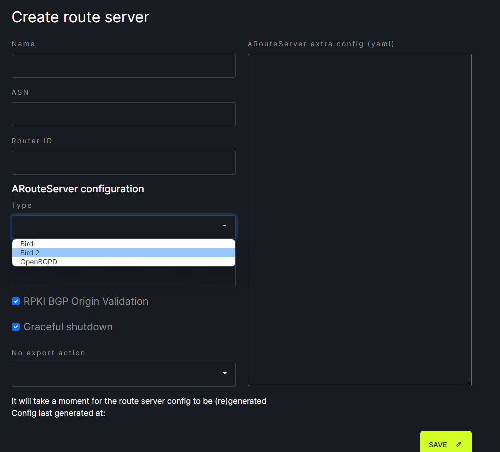
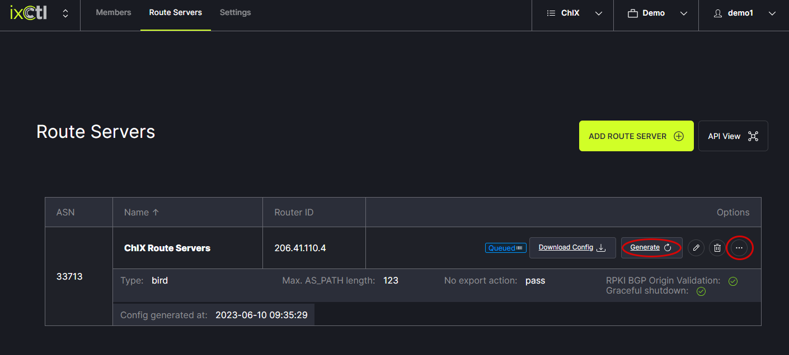

# Add a Route Server

Click on the Route Servers tab in the header menu. 
   
   
Choose the Exchange to which a route server will be added from the header menu. 
   
   
Next, click on the Add Route Server button.  
   

Enter the route server information and click Save.
   

Using the options hover, click on Generate to update the list after new prefixes are added.
   
