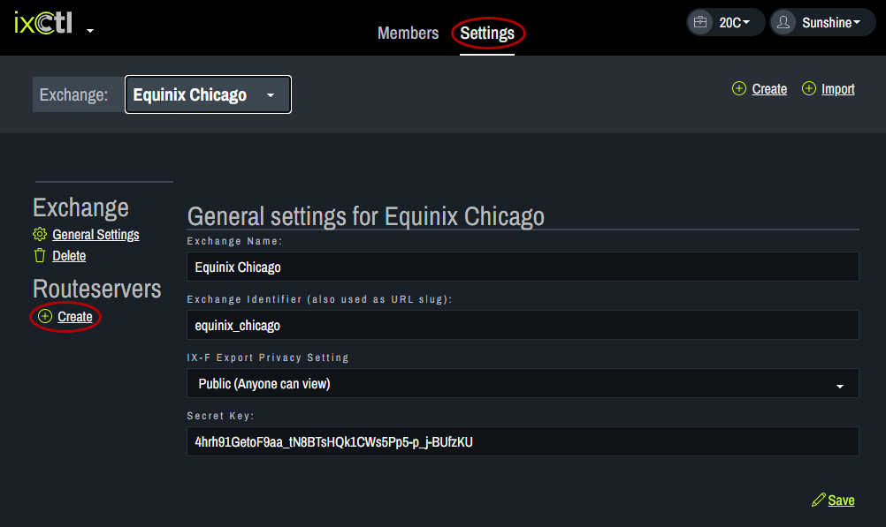
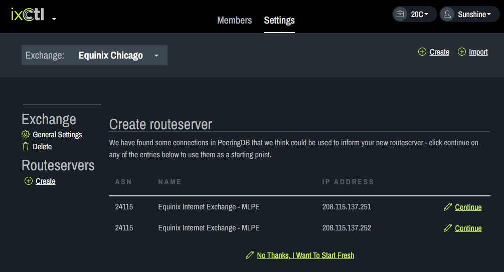

# Add Routeserver

To add a routeserver, click on the Settings tab. Click Create, which is below the Routeservers heading in the menu on the left.
   
There may be an option to use an existing routeserver as a starting point or start fresh by entering new information. 
   
