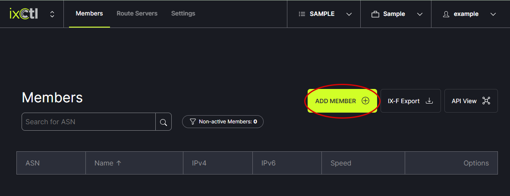
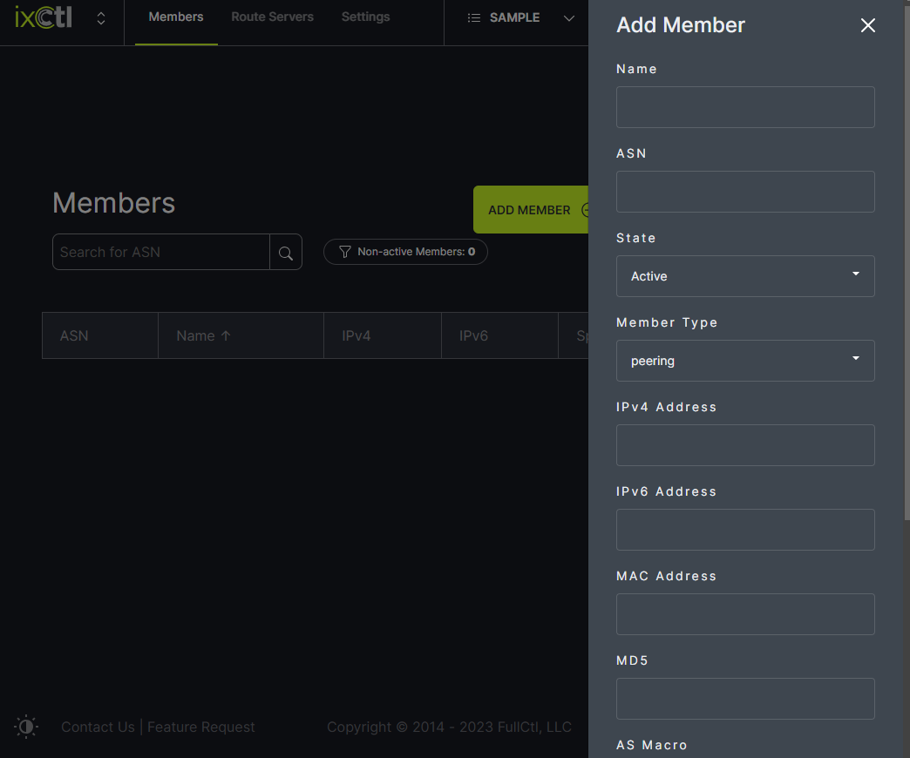
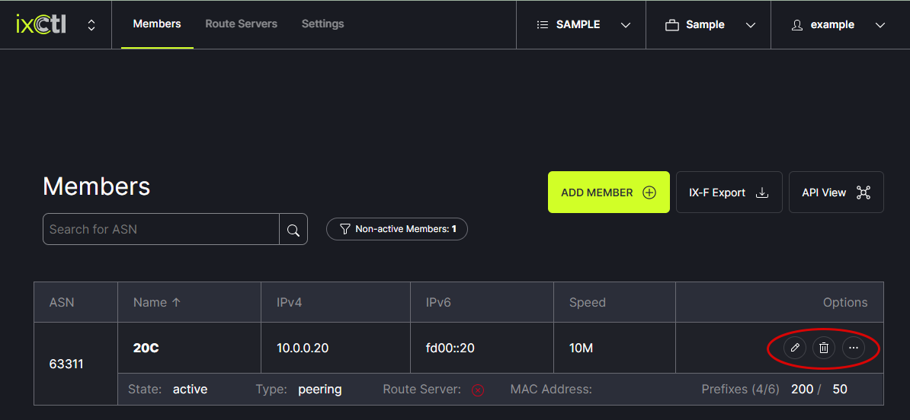

# Add a Member

Select the Exchange to which a member will be added from the header menu.  
   
   
Next, click on the Add Member button.
   

In the modal, enter the information and click Save.
   

Member information can be edited or the member can be removed using the options on the right side of the window.
   
