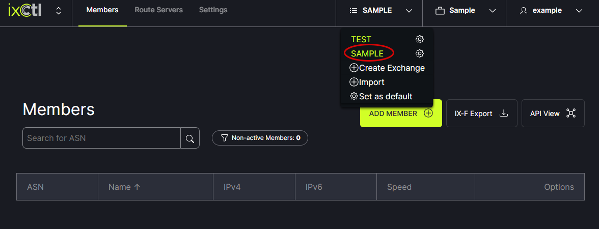

# Add a Member

Prefix lists and AS-SETs are populated from the IRRs. The AS-SET names come from PeeringDB by default. These can be overridden in ixCtl but it is best to update them in PeeringDB. 
Before adding a member to ixCtl, ensure the member has:
- Registered their prefix with radb (fee based), ARIN (if lacking legacy space) or altdb.
- Entered/updated their AS-Set in PeeringDB.

Select the Exchange to which a member will be added from the header menu.  
   
   
Next, click on the Add Member button.
   

In the modal, enter the information and click Save.
   

Member information can be edited or the member can be removed using the options on the right side of the window.
   
   
The drop down options in the header menu allow for setting a chosen member as the default.  
   
