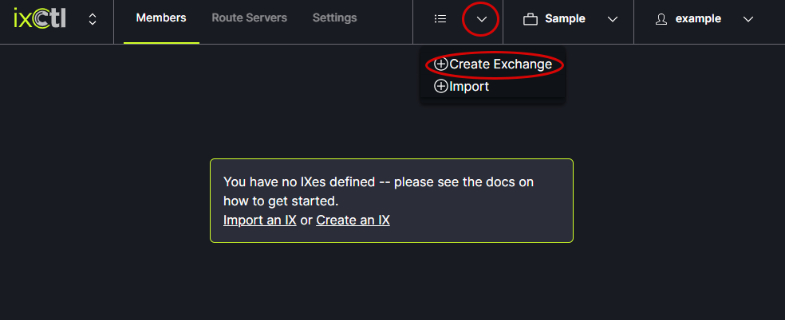
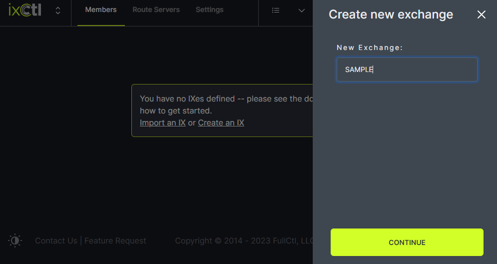

# Create an IX

From the drop down menu in the header, click Create Exchange.
   
   
In the modal, enter the New Exchange name and click Continue. An empty IX space will appear.
   
   
The name of the new exchange will appear in the header menu.
   
In the (new) empty IX space, a Member can be added. 
