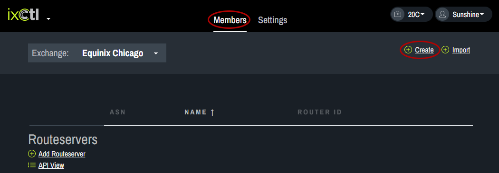
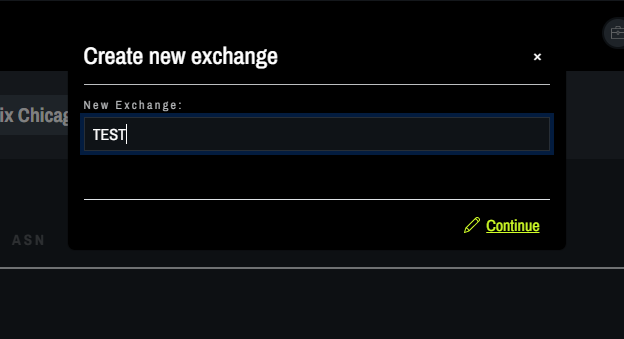

# Create an IX

From the Members tab, click on Create.
   
In the pop up box, enter the New Exchange name and click “continue.” An empty IX space will appear. 
    
In the empty IX space, a Routeserver or Member can be added. 
