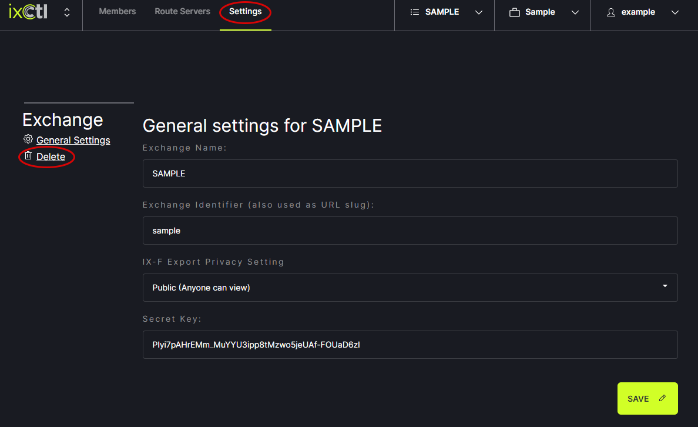

# Delete Exchange

To remove an exchange, select the Exchange to be removed from the header menu. 
   

Click on the Settings option in the header menu. Then, click Delete under Exchange on the left side menu.
   
