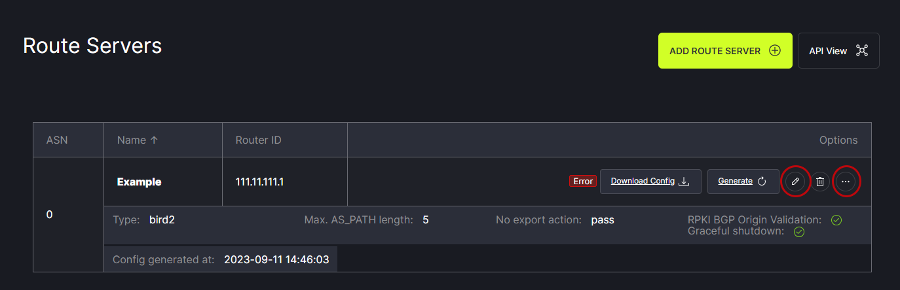
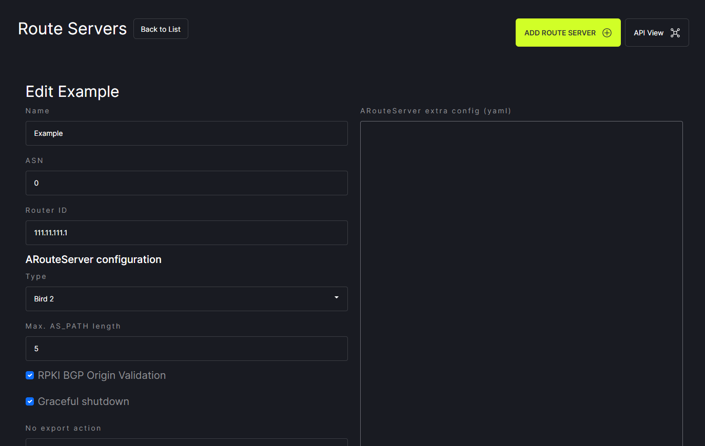

# Edit a Route Server

To edit an existing route server entry, mouse over the three dots on the right side of the window. Options for editing and deleting will be displayed. 
   

Click on the pencil icon to open the page for editing route server information. Make any desired changes and click save in the lower right corner. 
   
