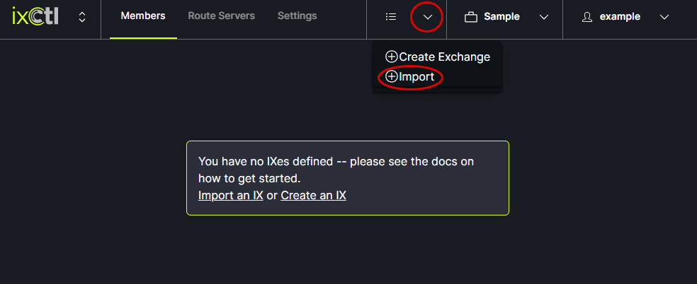
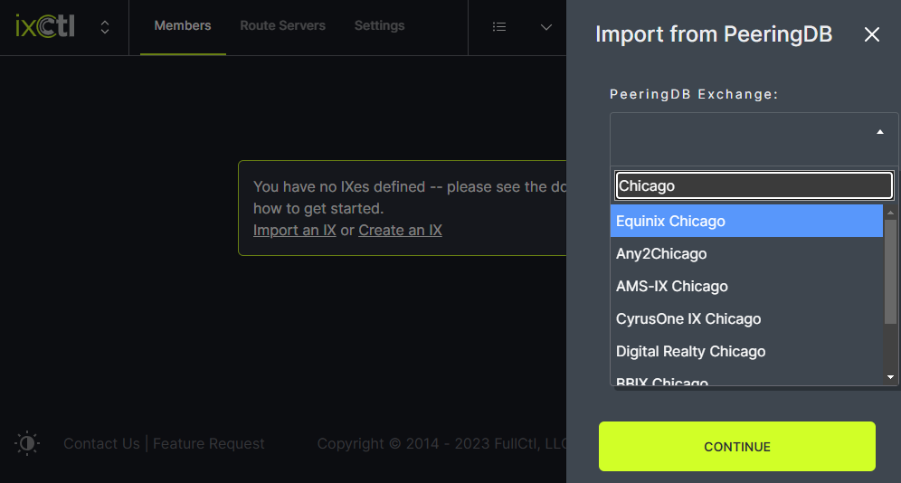

# Import an IX

From the drop down menu in the header, click on Import.
   
   
In the modal (Import from PeeringDB), enter the name of the IX you want to import and click continue. The IX information will appear.
   
