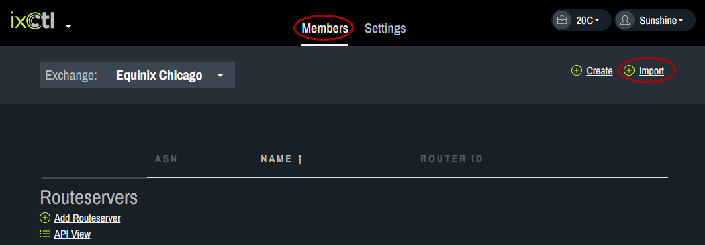
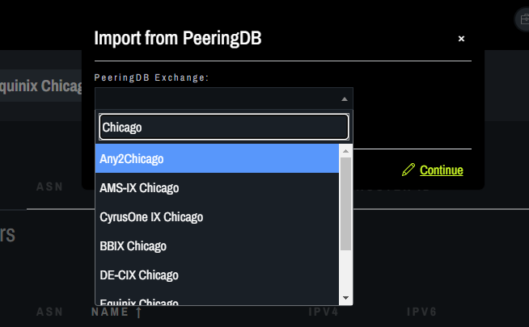

# Import an IX

From the Members tab, click on Import.
   
In the pop up box (Import from PeeringDB), enter the name of the IX you want to import and click continue. The IX information will appear.
   
