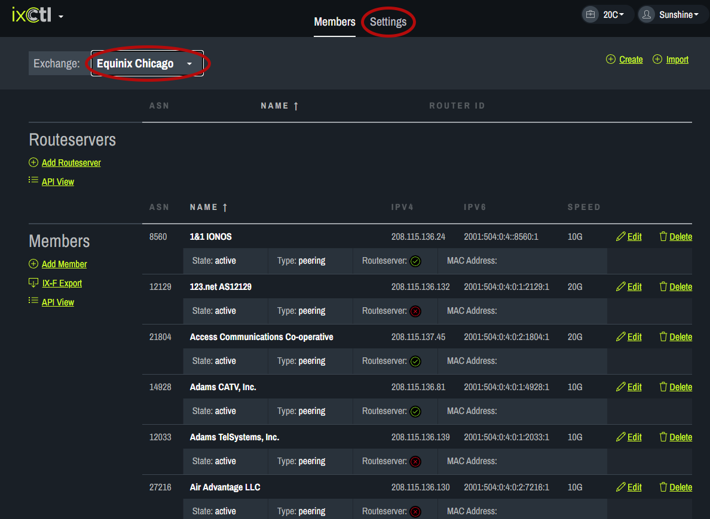
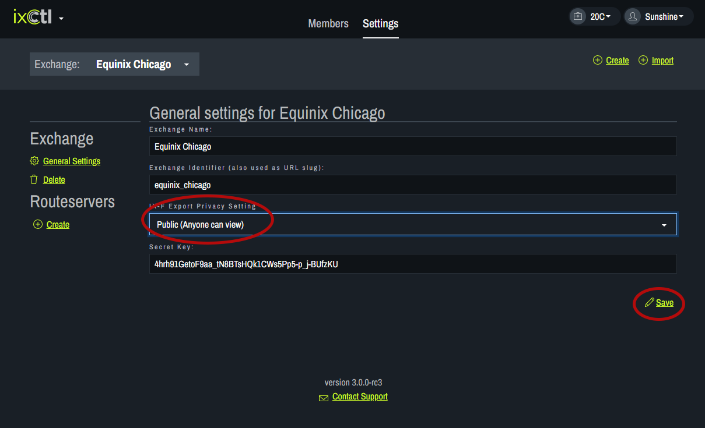
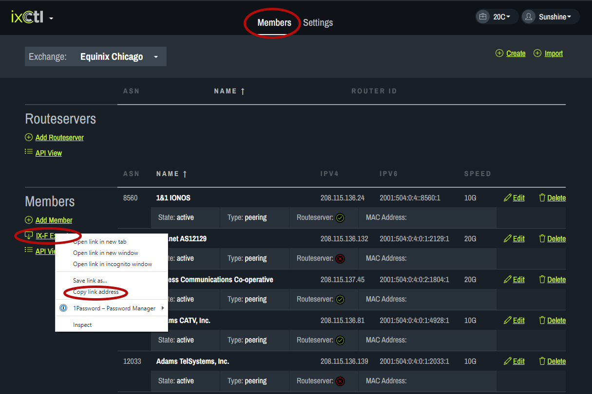
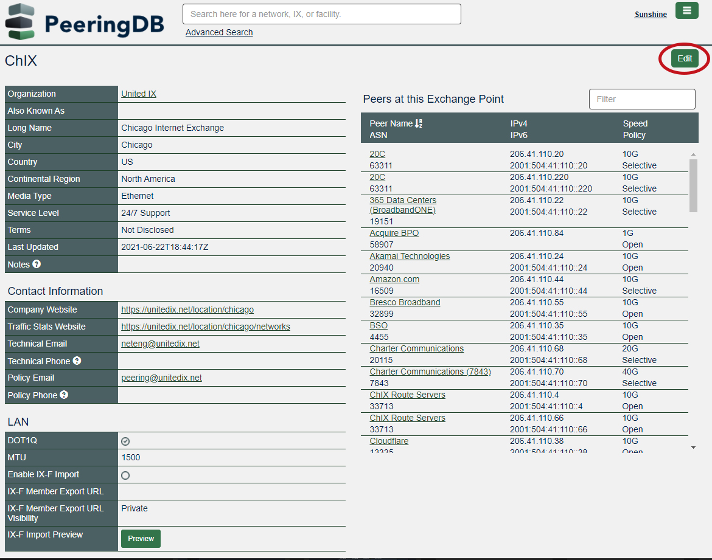
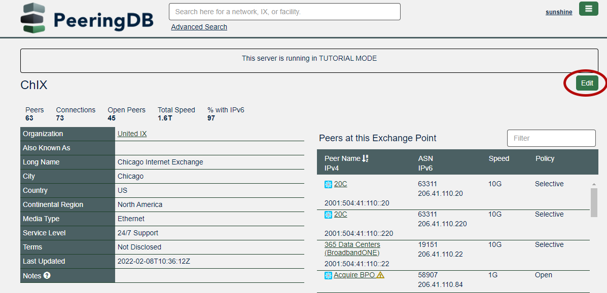
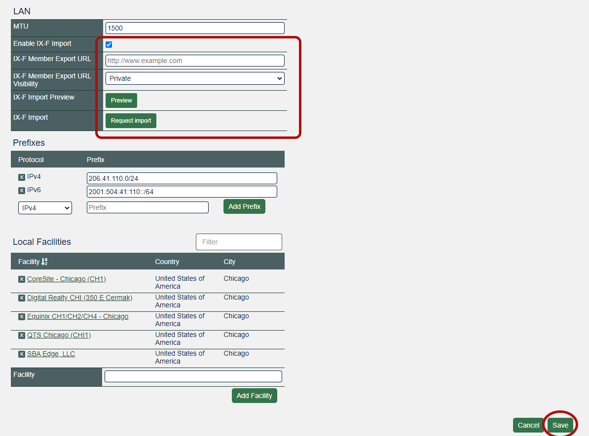

# Share the Member List
1. From the drop down menu, choose the IX page you want to share from. Then click on the Settings tab at the top of the page.
    
2. Under IX-F Export Privacy Setting choose “Public (Anyone can view)” or “Private (Requires secret key to view).” Click Save.
    
3. Click on the Members tab at the top of the page. Right click on the IX-F Export button and choose “copy link address.”   
    
4. Go to PeeringDB and log in to your account. Go to your IX.  
5. Click “Edit” in the upper right corner of the screen.  
      
6. In the Exchanges section, click on the name of the exchange you want to work with.
    
7. On the Exchange page, click on Edit in the upper right corner.
    
8. Under LAN, check the box next to Enable IX-F Import. In the box for IX-F Member Export URL, paste the link you copied from the IXCtl website. Click Preview to request an import during the next update (midnight UTC) or click Request Import for an immediate import. Click save in the lower right corner of the page. 
    

