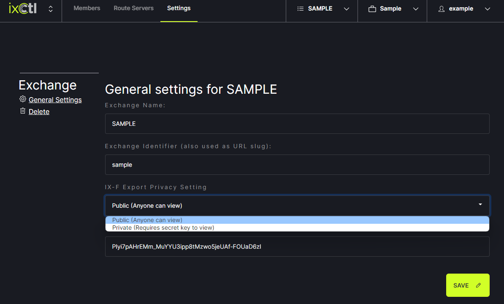

# Share the Member List

From the drop down menu in the header, choose the Exchange to be shared from. Then, click on the Settings tab in the header menu. 
   
   
Under IX-F Export Privacy Setting choose “Public (Anyone can view)” or “Private (Requires secret key to view).” Click Save.
   
   
Click on the Members tab at the top of the page. Right click on the IX-F Export button and choose “copy link address.” 
   

Go to PeeringDB and log in to your account. Go to your IX. 
   
   
In the Exchanges section, click on the name of the exchange you want to work with.
   
   
On the Exchange page, click on Edit in the upper right corner.
   
   
Under LAN, check the box next to Enable IX-F Import. In the box for IX-F Member Export URL, paste the link you copied from the IXCtl website. Click Preview to request an import during the next update (midnight UTC) or click Request Import for an immediate import. Click save in the lower right corner of the page.
   
