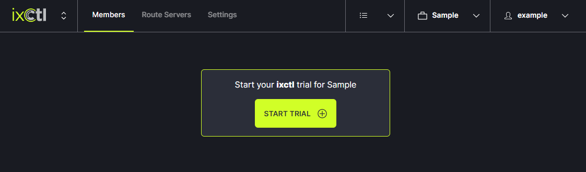
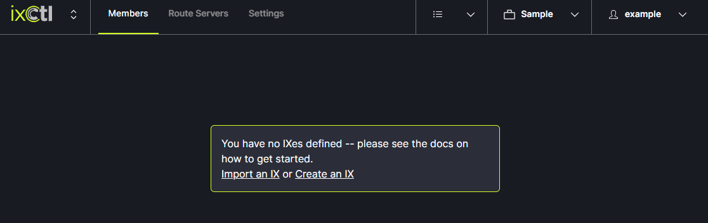

# Sign Up

1. Create your personal account on FullCtl.
2. Add your Organization to the site or request FullCtl Admin create it for you.
3. Invite other users to your Organization if desired.
4. Sign up for ixCtl. A Trial account is available at no cost.

5. Create or Import your exchange. Note: Each trial or billed subscription is
   applied per exchange (not per Organization).

6. Enter your members / route server information.
7. Work with FullCtl Admin to onboard / verify information.
8. Request verification from FullCtl Admin.

## Details
The free trial of ixCtl allows Users to enter IX and route server information and view how ixCtl functions. When you determine ixCtl is a good fit and meets your needs, contact us at <support@fullctl.com>. We will send you a form to fill out for each IX that will be onboarded. 

FullCtl staff will work with you to develop a plan for migrating from your current system to ixCtl. This process involves working with our Team to prepare for and schedule the route server migrations. We schedule maintenance windows that fit your schedule and guide you through the transition process. 

Cost for ixCtl services:

- Up to 35 members = free
- 36-75 members = $200/month
- 76+ members = $500/month

If your IX meets the criteria for paid services, credit card information is required before route server migration begins. Billing doesn’t begin until the end of your trial period. 
