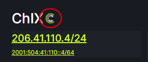

# Source of Truth

The final step in using ixCtl is to define it as your Source of Truth (SoT). After ixCtl becomes your SoT, your networks can use PeerCtl to update route server passwords and MAC-Addresses in your ixCtl environment. It is recommended that Organizations hold off on this step until you are ready to fully integrate ixCtl into your system. The FullCtl icon appears next to exchanges that have ixCtl as their SoT in PeerCtl on the IX tab. 

To indicate ixCtl as your Source of Truth, contact <support@fullctl.com> and request this option.
