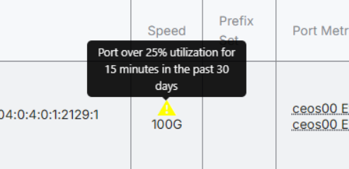

# Add Device

ixCtl can be configured to show high usage alerts to members when they reach a given use threshold. There is an option to send email alerts to Admins and (if desired) members as well. The polling interval for traffic alerts is 5 minutes. 

To set up traffic alerts, click on Settings in the header menu. Then choose Traffic Alerts from the menu on the left side of the window. 
   

Enter a number between 1 and 100 in the Traffic Level (%) field. This number indicates the threshold at which alerts are triggered. For example, entering 90 indicates that an alert will appear when use reaches 90% or more. 

Enter a number between 1 and 1440 in the Notification Frequency (minutes) field. This number indicates the amount of time the traffic level must exceed the given level before an alert is triggered. 

If email alerts are desired click the Operator Email Alerts box and/or the Member Email Alerts box. Select the Maximum Frequency (days) that emails will be sent. A different interval can be set for the Operator than the Member. Choosing 7 for example, means an email will be sent once every 7 days. 

Click Save. 
   

To set the Operator email where alerts are sent, click on the General Settings option in the left side menu on the Settings page. Enter the email(s) of the recipient(s). Click Save. 
   

In order for Members to receive traffic alert emails, the Member must do the following:

1. Create a FullCtl account.
2. Enter an email address in PeerCtl. 
3. Turn on the traffic alert feature in PeerCtl.

IX Operators may want to make Members aware of this feature and encourage them to turn on the feature and add their contact email address. [Instructions can be found on this page.](../PeerCtl/Traffic-Alerts.md)

To modify the email that will be sent, click on the Templates tab in the header menu. Then choose which template will be modified or create a new one using the New Email Template button.
   

When the traffic alert feature is activated, two types of traffic alert indicators appear in ixCtl on the IX page in the Speed column.

- Yellow triangle = alert was triggered in the past 30 days but is not currently active
- Red flame = alert is currently active (resets to yellow if traffic drops below threshold)
  
   

Members see traffic alert indicators in PeerCtl on the IX page next to the speed. 
   
