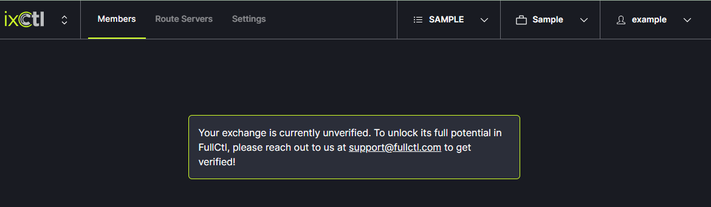

# Verify Exchange

Your exchange must be verified to fully use ixCtl. You will see a message on screen until your exchange is verified. Note: each exchange added must be verified individually. It is recommended that a new user to ixCtl fully set up their information on the site before requesting verification. Verification allows IXs to update their configuration on your route servers so it is best to hold off on this step until you are ready to fully integrate ixCtl into your system. 
   
   
Contact us at support@fullctl.com to request verification. After verification, your networks can use PeerCtl to update route server passwords and MAC-Addresses in your ixCtl environment.
