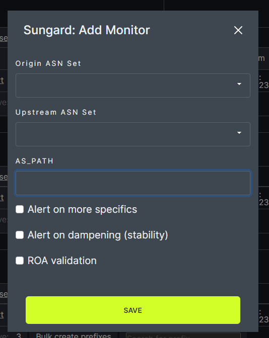
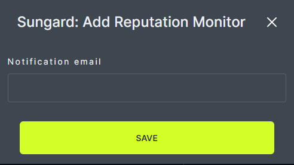

# Add Monitor

A Reputation Monitor can be assigned to each prefix set. Each prefix set can have only one Reputation Monitor. The Reputation Monitor will receive email notifications when reputation issues are found. When a Reputation Monitor is assigned, an automatic check will occur once per day.
   

In the modal, choose ASN monitor or Reputation Monitor and click Continue. Note: ASN monitor has been temporarily disabled.
   

If ASN Monitor is chosen, enter the preferred options in the next modal and click Continue. 
   
   
If Reputation Monitor is chosen, enter the email address of the person who is to receive notifications.
   
   
When a Monitor has been assigned, the Reputation Monitor field will list Active and the options chosen will appear with check marks. Monitor information can be edited or deleted using the tools on the right side of the page.
   
