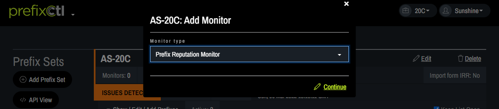
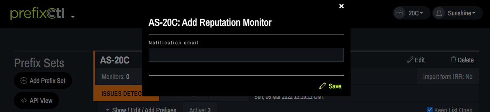
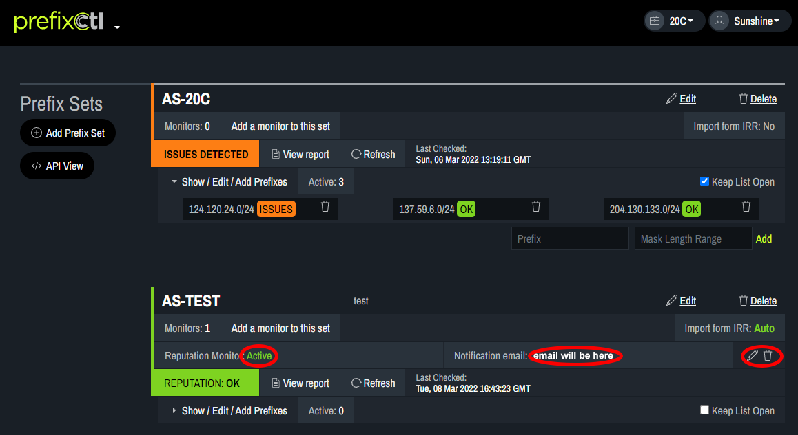

# Add Monitor

A Reputation Monitor can be assigned to each prefix set. Each prefix set can have only one Reputation Monitor. The Reputation Monitor will receive email notifications when reputation issues are found. When a Reputation Monitor is assigned, an automatic check will occur once per day.
1. To assign a Monitor to a Prefix set, click Add a monitor to this set.
   
2. In the pop-up box, choose Prefix Reputation Monitor from the drop-down box. Click Continue.
   
3. In the pop-up box, enter the email of the person who will be the monitor. Click Save
   
4. When a Monitor has been assigned, the Reputation Monitor field will list Active and the Monitor’s email address will appear in the Notification email field. Monitor information can be edited or deleted using the tools on the right side of the table.
   
