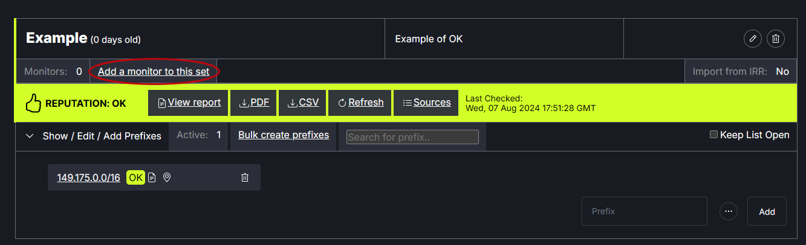

# Add Monitor

A Reputation Monitor can be added to each prefix set. The Reputation Monitor(s) will receive email notifications about reputation issues. When a Reputation Monitor is assigned, an automatic check will occur once per day.

There are two types of of reputation monitoring to choose from. There is a daily option in which an email is sent once per day noting the status of the prefix set, whether it has changed from the previous day or not. The second option is to receive an email only when the prefix has issues.

To add a reputation monitor to a prefix set, click Add a monitor to this set.
   

In the modal, enter one or more email addresses and choose the daily email option or issues only option.
   

When a Monitor has been assigned, the Reputation Monitor field will list Active, Alert Type will be displayed and the notification email(s) will appear. Monitor information can be edited or deleted using the tools on the right side of the table.
   
