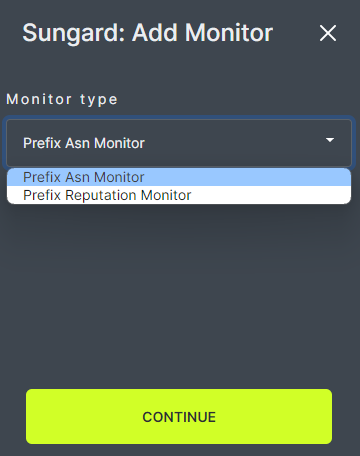

# Add Monitor

A Reputation Monitor can be assigned to each prefix set. Each prefix set can have only one Reputation Monitor. The Reputation Monitor will receive email notifications when reputation issues are found. When a Reputation Monitor is assigned, an automatic check will occur once per day.

To assign a Monitor to a prefix set, click Add a monitor to this set.
   

In the pop-up box, choose the preferred monitoring types using the check boxes.
   

When a Monitor has been assigned, the Reputation Monitor field will list Active and the options chosen will appear with check marks. Monitor information can be edited or deleted using the tools on the right side of the page.
   
