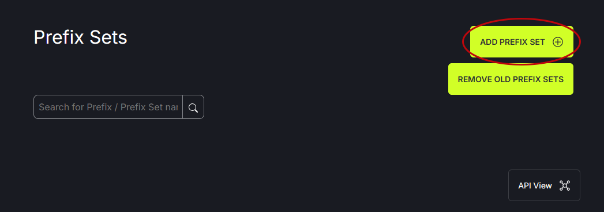
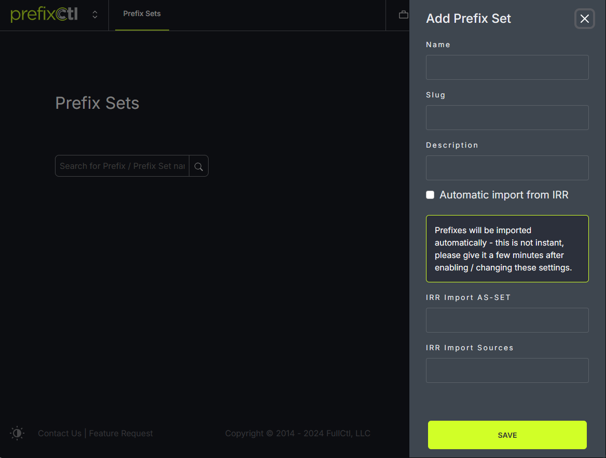

# Add Prefix Set

To add a prefix set, click on the Add Prefix Set button on the right side of the window.
   

In the modal, fill in the name of the set and a short description. Click on Automatic import from IRR if you want IRR integration. When automatic IRR import is enabled the prefixes in this prefix set are managed automatically. Users are not able to add or remove prefixes from the prefix set when IRR import is enabled because updates are automatic. Fill in the IRR Import AS-SET and/or the IRR Import Sources. Click Save.
   

A prefix set can be edited using the Edit option in the upper right side of the table. This allows the information that was originally entered about the prefix to be updated.
   
