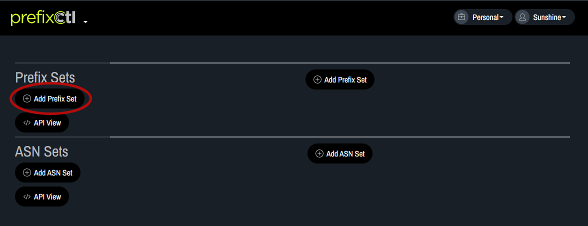
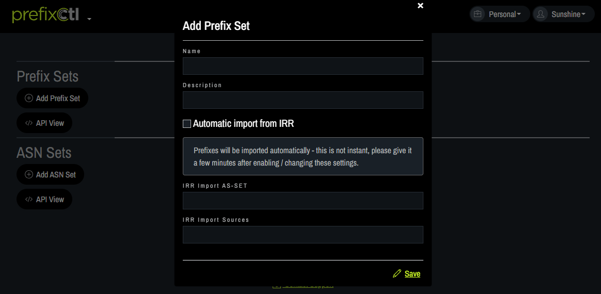

# Add Prefix Set

1. Click on Add Prefix Set.
   

2. In the pop up box, fill in the name of the set and a short description. Click on Automatic import from IRR if you want IRR integration. When automatic IRR import is enabled the prefixes in this prefix set are managed automatically. Users are not able to add or remove prefixes from the prefix set when IRR import is enabled because updates are automatic. (This feature is experimental as of 3/2022). Fill in the IRR Import AS-SET and/or the IRR Import Sources. Click Save.
   
