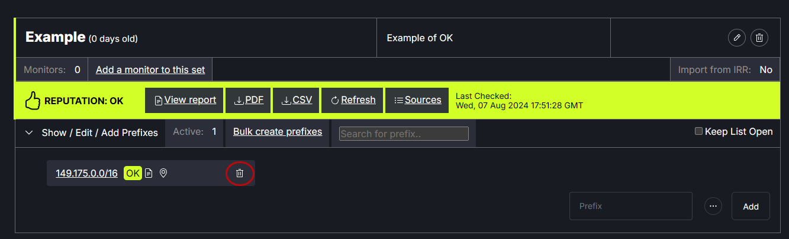

# Add Prefixes to a Prefix Set

After a prefix set has been created, one or more prefixes can be added. To enter prefixes, either paste the prefix into the prefix field and click Add OR click on Bulk create prefixes and paste any number of prefixes then click Save. Note: The system may error if there are extra spaces before or after prefixes entered.
   
   

Prefixes can be removed from a prefix set using the trash can icon next to a prefix.
   
