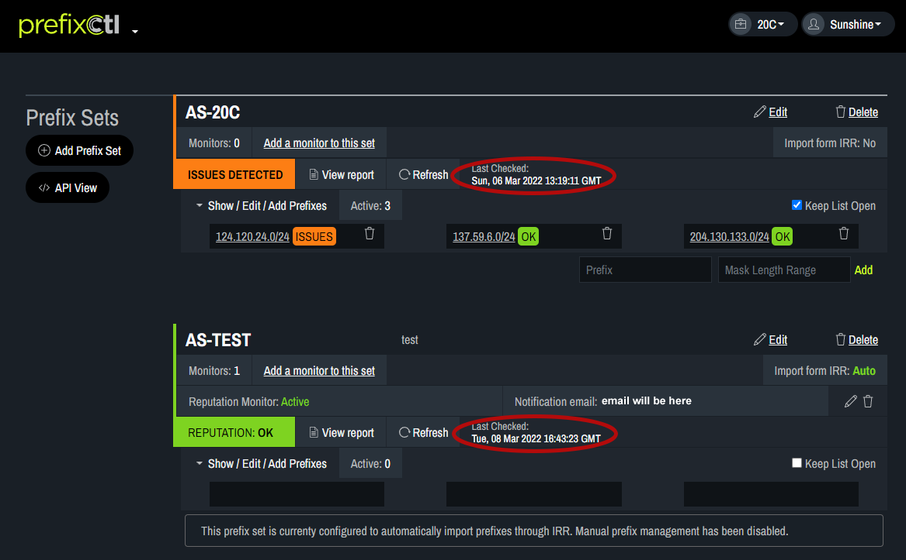
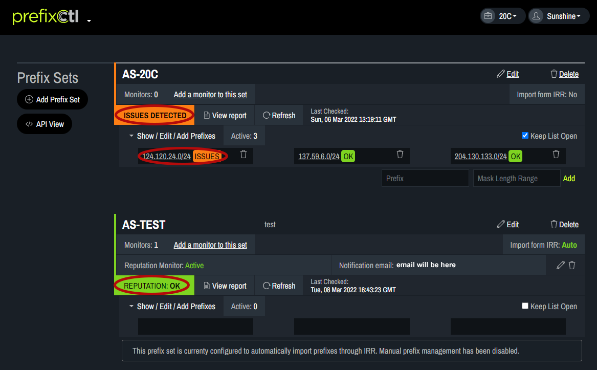

# Check Reputation

The date and time of the last reputation check appears next to each prefix set.
   

To update the reputation check, click Refresh. This may take a few moments to process.
   

The Reputation status will appear as either “Issues Detected” to indicate the check found a problem with one or more of the prefix sets or “ Reputation Ok” to indicate there are no problems with the prefix sets. The specific prefix with issues will appear in the list view.
   

Click on View report to see a list containing each prefix. If there are no issues the box that pops up will be empty.
   

In the pop-up box, issues can be identified by scrolling to find items flagged. Clicking on History provides a list of issues at the same IP address over the past 12 months. In the history view, each entry indicates a specific issue at the IP address at the point it was seen.
   
