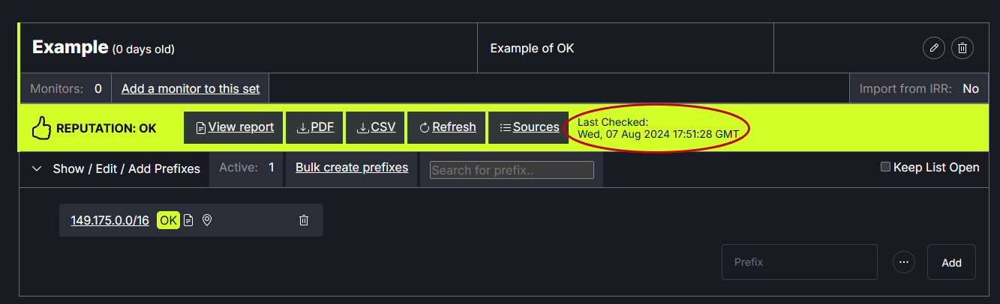
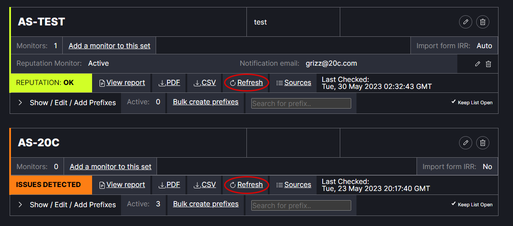
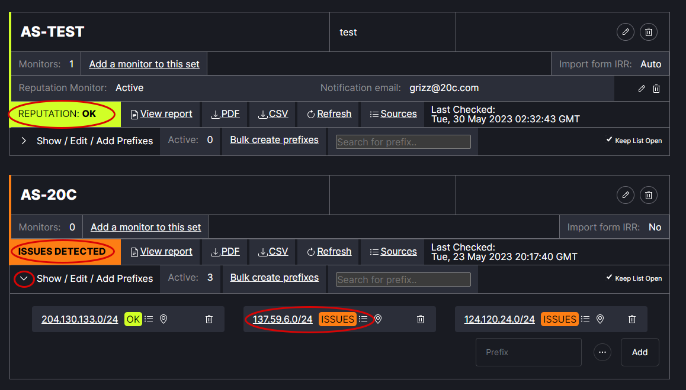
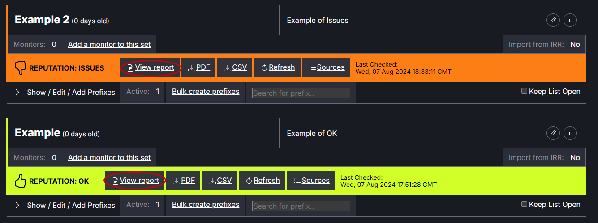
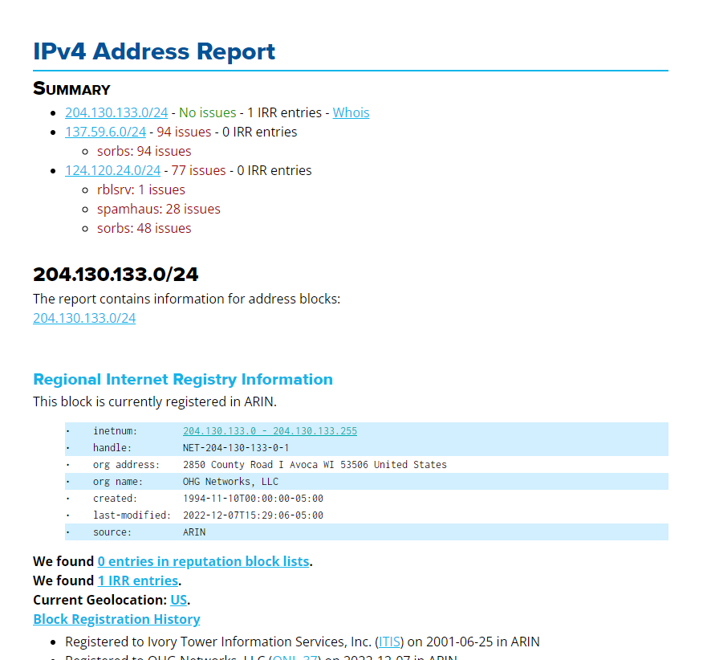
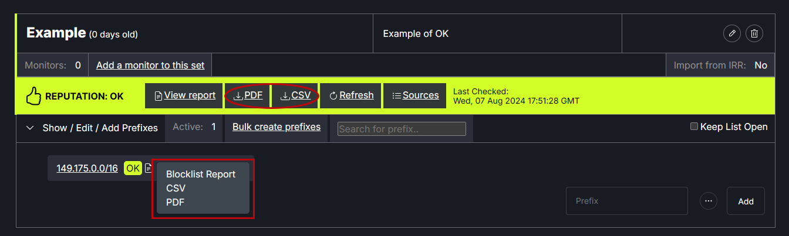

# Check Reputation

Note: The reputation report feature is not available by default. Users must request and be granted access to use this feature.

The date and time of the last reputation check appears next to each prefix set.
   

To update the reputation check, click Refresh. This may take a few moments to process.
   

The Reputation status will appear as either “Issues” to indicate the check found a problem with one or more of the prefix sets or “Ok” to indicate there are no problems with the prefix sets. Click the arrow next to Show / Edit / Add Prefixes to expand the list. The specific prefix with issues will appear in the list view.
   

Click on View report to view the IPv4 Address Report. Note: Users must request and be granted access to use this feature.
   

If there issues they are noted in the summary at the top and detailed below. 
   

There are options to download the report as a PDF or CSV file. The report can be run for the full prefix set or for an individual prefix.
   
