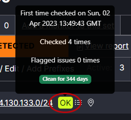

# Check Reputation

Note: The reputation report feature is not available by default. Users must request and be granted access to use this feature.

The date and time of the last reputation check appears next to each prefix set.
   

To run the first reputation check or update the current reputation check, click Refresh. This may take a few moments to process.
   

The Reputation status will appear as either “Issues” to indicate the check found a problem with one or more of the prefix sets, “Ok” to indicate there are no problems with the prefix sets or “Invalid” to indicate something prevented the report from running.
   

If the reports has ISSUES, click the arrow next to Show / Edit / Add Prefixes to expand the list. The specific prefix(s) with issues will appear in the list view.
   
   
A health check report can be viewed by hovering the cursor over the prefix badge (ok or issues). The report lists the first time the prefix was checked, the total number of times it has been checked, how many times there have been issues, and how many days the report has been clean.

   
   

If the report is INVALID it means one of the sources failed during the generation process. Any failing source will invalidate the entire report. To remedy this situation, click on "Sources" to find out which one failed. Removing the identified IP from the prefix set will stop the error generation. 

   

Click on View report to view the IPv4 Address Report. Note: Users must request and be granted access to use this feature.
   

If there issues they are noted in the summary at the top and detailed below. 
   

There are options to download the report as a PDF or CSV file. The report can be run for the full prefix set or for an individual prefix.
   

Note: There is a 1-day cache for data that appears on a report. If an update is made to address an issue noted in a report, it may take up to 24 hours for that change to be reflected on the report. 
