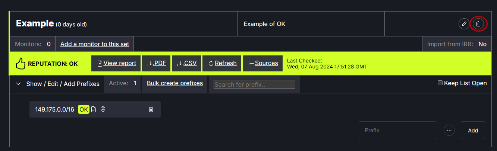
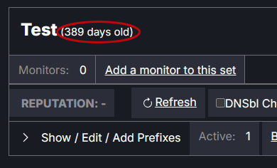
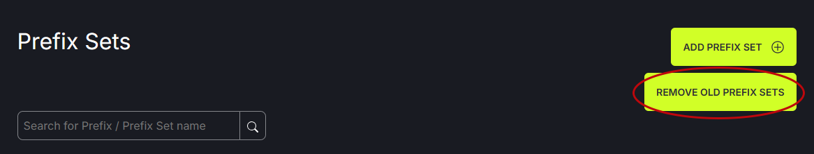
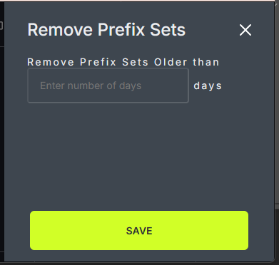

# Prefix Set Removal

Individual prefix sets can be removed using the trash can icon in the upper right corner of the window.
   

Prefix Sets can also be removed based on their age. The length of time a prefix set has been on the site appears next to the title. 
   

Clicking on the Remove Old Prefix Sets button in the upper right corner of the window opens a modal. Enter a number to remove all prefix sets older than X days old. Save.
   
   
