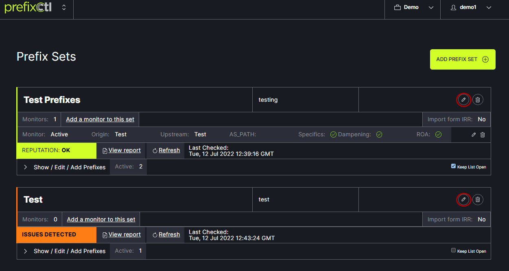

# Settings

Use the arrow next to Show/Edit/Add Prefixes to view the prefix sets. When the check box on the right side of the table is checked, the prefix sets will remain in view at all times. Unchecking the box will remove the list view on the next refresh. 
   

A prefix set can be edited using the Edit option in the upper right side of the table. This allows the information that was originally entered about the prefix to be updated.
   
